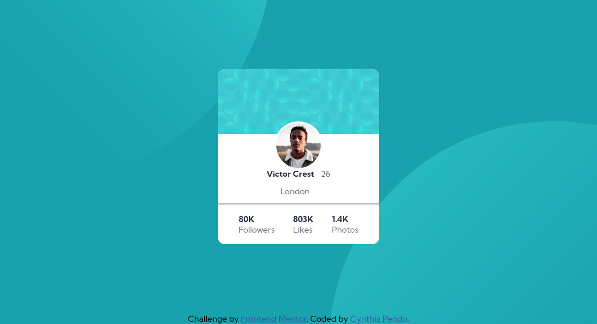

# Frontend Mentor - Profile card component solution

This is a solution to the [Profile card component challenge on Frontend Mentor](https://www.frontendmentor.io/challenges/profile-card-component-cfArpWshJ). Frontend Mentor challenges help you improve your coding skills by building realistic projects. 

## Table of contents

- [The challenge](#the-challenge)
- [Screenshot](#screenshot)
- [Built with](#built-with)
- [Author](#author)

### The challenge

- The challenge is to build a profile card component that looks as close as possible to the provided design templates in the design folder.

### Screenshot

### Built with

- HTML
- CSS 

## Author

 - Cynthia Pendo
